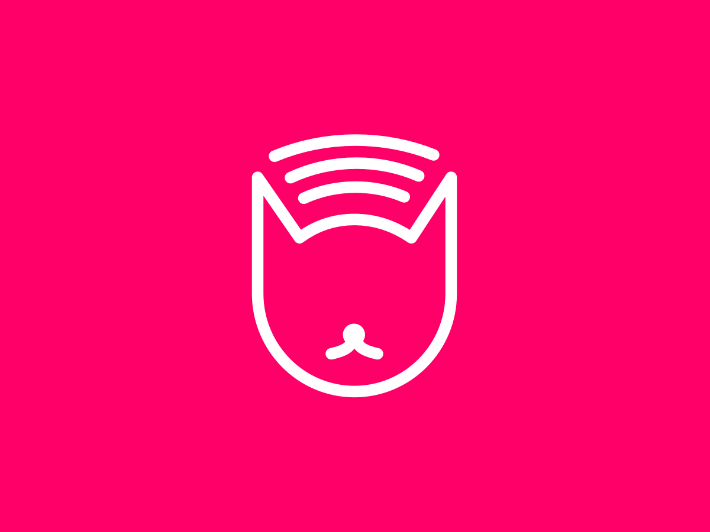

<p align="center">
    
</p>
<h1 align="center">
  Paws
</h1>

## Requirements

* PHP >= 7.1 (use PHP v7.4 for better compatibility)
* Composer - [Install](https://getcomposer.org/doc/00-intro.md#installation-linux-unix-osx)
* NPM - [Install](https://www.npmjs.com/get-npm)

## Installation

1. Install WordPress, plugins and dependencies, check what is outdated and update all by running:
    ```sh
    composer install
    composer outdated
    composer update
    ```
2. Update environment variables in the `.env` file, only the specified ones:
  * Database variables
    * `DB_NAME` - Database name
    * `DB_USER` - Database user
    * `DB_PASSWORD` - Database password
    * `WP_ENV` - Set to environment (`development`, `staging`, `production`)
    * `WP_HOME` - Full URL to WordPress home (https://example.com)
    * `AUTH_KEY`, `SECURE_AUTH_KEY`, `LOGGED_IN_KEY`, `NONCE_KEY`, `AUTH_SALT`, `SECURE_AUTH_SALT`, `LOGGED_IN_SALT`, `NONCE_SALT`
      * Generate with [our WordPress salts generator](https://roots.io/salts.html)

3. Set the document root on your webserver to Bedrock's `web` folder: `/path/to/site/web/`
4. Access WordPress admin at `https://example.com/wp-admin/`

# Purr Paws

1. ```cd web/app/themes/paws/build```
2. ```sh
	npm install
	npm run dev
	gulp
	```